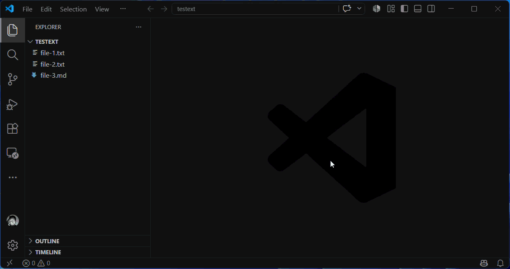

# Workspace Downloads

Repeatable batch downloads of selected workspace files to your local machine,
from remote or local VS Code workspaces. Download one or more exact paths or glob
matches at once, then save recurring download configuration in workspace settings
for quick, repeated execution.

The extension works with local folders and desktop VS Code windows connected through Remote
SSH, Dev Containers, WSL, Remote Tunnels, or Codespaces. This is particularly
useful when the files you need are in a remote development environment but the
application that uses them is on your computer. Browser VS Code and web
Codespaces are not supported.

## Why Workspace Downloads

VS Code can download one file at a time from the Explorer view. Workspace Downloads is for recurring
downloads: select one or more exact paths or glob matches, preserve their directory
structure, and run the same configured download whenever you need fresh files.

## Demos

Download one file or several exact workspace-relative files by entering their names, separated with semicolons.


Use glob patterns to download matching files. For example, `*.txt` downloads all matching text files from the selected workspace folder.



Save a list of files and patterns in workspace settings, then run the configured-files command whenever you need the same download again.


## Commands

* `Workspace Downloads: Download Workspace Files...` prompts for semicolon-separated workspace-relative paths or glob patterns and a local destination.
* `Workspace Downloads: Download Configured Files` downloads the files and patterns saved in workspace settings.
* `Workspace Downloads: Clear Remembered Download Answers` removes the values remembered for the ad hoc command.

The ad hoc command remembers your most recent file list and destination for each workspace folder. In a multi-root workspace, select the source folder before paths are evaluated.

## Select Files

Enter exact file paths and glob patterns relative to the workspace folder. Separate entries with semicolons for `Download Workspace Files...`.

```text
reports/result.json;logs/*.txt
```

Use `/` as the path separator on every operating system. Absolute paths, `..`, backslashes, and directories are not valid entries. If an entry does not match a file, the matching entries still download. If no entries match, no download starts.

## Configuration

For repeatable downloads, add file entries to your workspace or workspace-folder settings. Use one workspace-relative file path or glob pattern per nonempty line.

```json
{
	"workspaceDownloads.files": "reports/result.json\nlogs/*.txt",
	"workspaceDownloads.destination": "C:\\temp\\project-a",
	"workspaceDownloads.conflictPolicy": "replace"
}
```

`workspaceDownloads.destination` is optional. When it is empty, the command prompts for a local destination and remembers the last one you entered for that workspace folder. `workspaceDownloads.conflictPolicy` defaults to `prompt`; set it to `replace` or `skip` for unattended handling of destination conflicts. You can also run `Workspace Downloads: Configure Download Conflict Policy` from the Command Palette to open this setting directly. All settings have resource scope, so a folder in a multi-root workspace can define its own values. Only workspace and workspace-folder settings are used; user defaults are ignored.

The destination is always a local path on the desktop client. Do not commit a machine-specific destination to shared workspace settings unless every collaborator uses the same local path and operating system.

## Download Behavior

Downloaded files retain their source-relative directory structure below the destination. When destination files already exist, or source paths differ only by letter casing, the default `prompt` policy lets you choose once per download whether to replace all, skip all, or cancel. The `replace` and `skip` policies handle all conflicts without a dialog. After a download, you can open the destination or view details in the `Workspace Downloads` output channel.

> [!NOTE]
> Downloads read one complete source file into extension-host memory before writing it. Very large files can exhaust memory. Transfers can be cancelled between files, but not during a single file.

## Privacy

Workspace Downloads collects no telemetry and does not require accounts, external services, credentials, uploads, or synchronization. It uses VS Code's existing workspace filesystem access and writes only to the local destination you select.

## Development

```bash
npm ci
npm run compile
xvfb-run -a npm test
npm run package:vsix
```

See [Contributing](CONTRIBUTING.md) and [Security](SECURITY.md).
For help, see [Support](SUPPORT.md).
